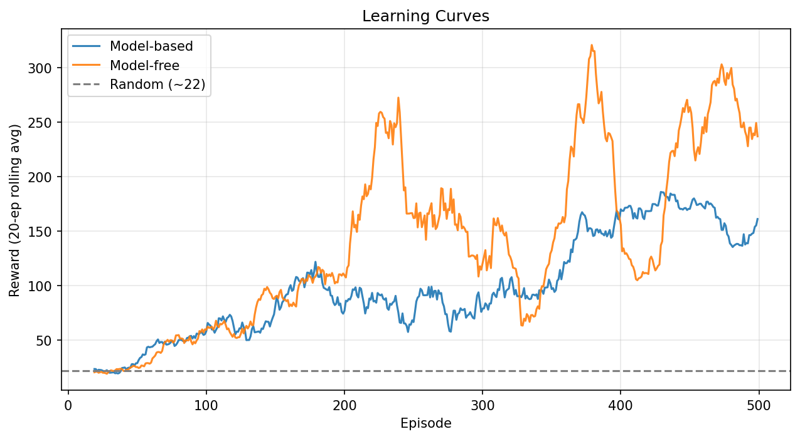
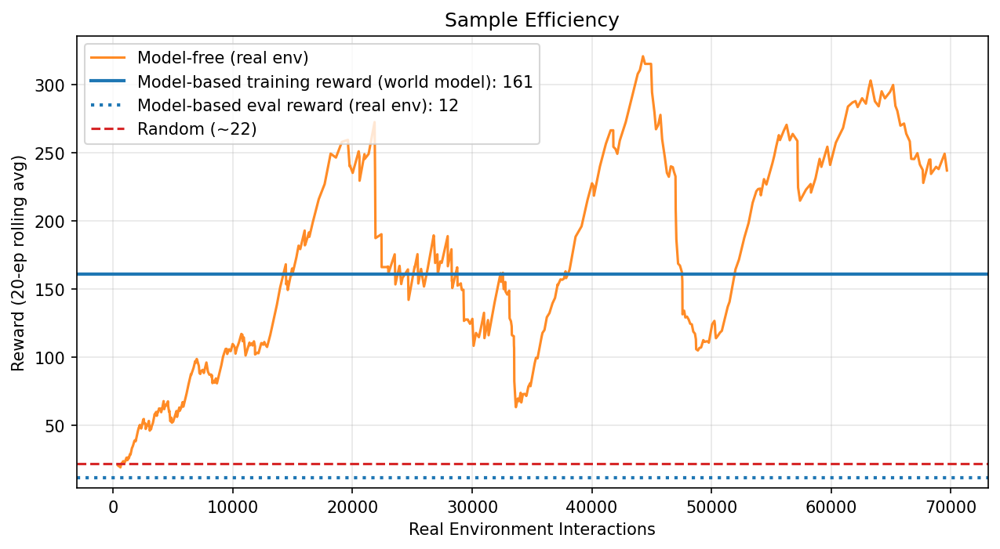
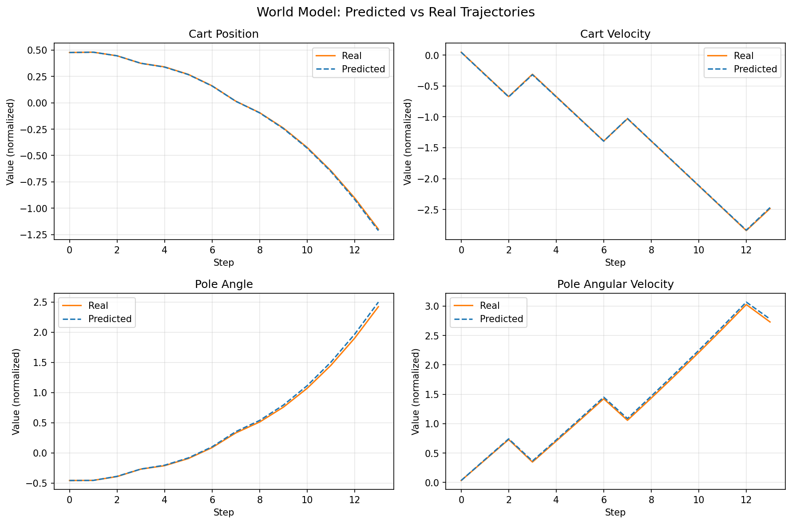
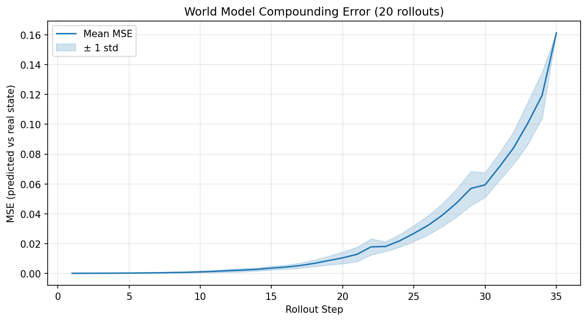

# Model-Based Reinforcement Learning for CartPole

This project explores **model-based reinforcement learning** (MBRL) by training a learned world model of the CartPole environment and using it to train a DQN agent entirely in simulation. The core question: can we reduce the number of real environment interactions needed to learn a good policy?

## Approach

1. **Data collection** -- gather transition data from CartPole using a random policy
2. **World model training** -- train a neural network to predict state transitions and rewards from (state, action) pairs
3. **Agent training** -- train a DQN agent inside the learned world model instead of the real environment
4. **Evaluation** -- evaluate all agents on the real CartPole environment and compare

Three agents are compared:
- **Model-based** -- DQN trained inside the world model
- **Model-free** -- DQN trained directly on the real environment (baseline)
- **Random** -- random action selection (floor baseline)

## Project Structure

```
.
├── app.py                  # Streamlit web app
├── config.py               # Configuration flags and paths
├── main.py                 # Main pipeline: train and evaluate all agents
├── main_train_wm.py        # World model training pipeline
├── main_sweep.py           # Hyperparameter sweep over reward weight
├── run_experiments.py       # Single entry point to reproduce all results
├── requirements.txt
├── models/                 # Saved model weights
│   ├── wm.pt              #   World model
│   ├── agent_modelbased.pt #   Model-based DQN
│   ├── agent_modelfree.pt  #   Model-free DQN
│   └── best/               #   Best model-based agent
├── training/
│   ├── agent_base.py       # Abstract agent interface
│   ├── agent_dqn.py        # DQN agent
│   ├── agent_random.py     # Random agent baseline
│   ├── train_agent.py      # Agent training loop
│   ├── train_wm.py         # World model training loop
│   ├── evaluate_agent.py   # Agent evaluation
│   └── env_wm.py           # World model wrapped as a Gym-like env
├── models/
│   └── wm.py               # World model architecture (MLP)
├── utils/
│   ├── data_collection.py  # Random policy data collection
│   ├── preprocessing.py    # Normalization, one-hot encoding, deltas
│   ├── evaluation.py       # Multi-step rollout evaluation
│   └── logger.py           # Text and CSV logging
├── visualization/
│   ├── plot_learning_curves.py
│   ├── plot_sample_efficiency.py
│   ├── plot_trajectories.py
│   └── plot_wm_error.py
├── logs/                   # Run logs and training CSVs
├── figures/                # Generated plots
└── results/                # Summary tables
```

## Getting Started

### Install dependencies

```bash
pip install -r requirements.txt
```

### Run all experiments from scratch

```bash
python run_experiments.py
```

This will train the world model, train both DQN agents, evaluate all three agents, generate all plots, and save a summary table to `results/summary.csv`.

### Run with configuration

Edit `config.py` to control what gets retrained:

```python
RETRAIN_AGENT = False    # Set True to retrain model-based agent
RETRAIN_WM = False       # Set True to retrain world model
RETRAIN_MODELFREE = False # Set True to retrain model-free agent
```

Then run:

```bash
python main.py
```

### Generate plots individually

```bash
python visualization/plot_learning_curves.py
python visualization/plot_sample_efficiency.py
python visualization/plot_trajectories.py
python visualization/plot_wm_error.py
```

### Launch the web app

```bash
streamlit run app.py
```

## Results

### Learning Curves

Training reward over episodes for model-based and model-free agents:



### Sample Efficiency

Reward as a function of real environment interactions. The model-based agent uses ~7k real interactions (for data collection) vs ~70-100k for model-free:



### World Model Accuracy

Predicted vs real trajectories across the 4 state dimensions. The world model tracks reality closely for the first ~10 steps, then diverges:



### Compounding Error

World model prediction error grows exponentially over rollout steps:



## Key Findings

- **Sample efficiency**: the model-based approach uses ~10x fewer real environment interactions than model-free DQN
- **Sim-to-real gap**: despite learning well inside the world model (~150-200 reward), the model-based agent transfers poorly to the real environment (~15 reward)
- **Compounding error**: the world model is accurate for single-step predictions (MSE ~0.00005) but errors compound rapidly over multi-step rollouts, explaining the transfer gap
- **Model-free baseline**: vanilla DQN trained directly on CartPole achieves ~200-350 reward, confirming the environment is learnable

## Limitations

- The world model is a simple MLP predicting one-step deltas; more sophisticated architectures (ensemble models, latent dynamics) could reduce compounding error
- The agent trains on open-loop rollouts from the world model, amplifying model inaccuracies; Dyna-style approaches that mix real and simulated data could help
- CartPole is a simple environment; the sim-to-real gap would likely be more pronounced in higher-dimensional tasks
- Multiple random seeds would give more reliable evaluation estimates
